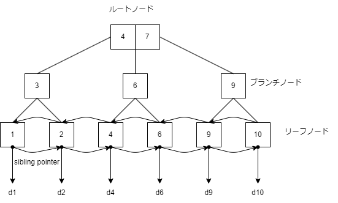

# インデックス

B+Tree以外にもインデックスの種類はあるが、ここでは説明しない。

## 1.B+Treeインデックス

B+Treeは、名前の通りデータを木構造で保持するインデックスのこと。
バランスがとれており、インデックスをなんの修飾もなくインデックスを作成する場合は、このインデックスになる。

B+Treeインデックスのイメージは下記の通り。



B+Treeが優れている点は、たとえば次のような点である。

- ルートノードとリーフノードの距離が一定に保たれており、検索性能が安定している。
- 木構造の深さが3～4レベルほどで一定。
- データがソートされて保持されているため、検索コストが低い。

## 2.インデックスを有効活用するためには

B+Treeの長所は、汎用性の高さである。。
キー値の間で検索速度にばらつきが少なく、データ量増加に対して検索速度の劣化が緩やかで、
等号だけでなく不等号を使用した検索条件でも使用可能である。
しかし、インデックスもとにかく作ればよいものではなく、ポイントを考慮する必要がある。

### 2-1.カーディナリティと選択率

インデックスはテーブルの特定の列集合に対して作成するが、このときどのような列に対してインデックスを
作成すべきかの基準となるのが列のカーディナリティと選択率である。

| 項目 | 概要 |
| :--: | :-- |
| カーディナリティ | 列の値がどれだけばらついているか。 |
| 選択率 | 特定の列の値を指定したとき、母集合に対してどれだけ絞り込めるか。 |

#### 2-1-1.カーディナリティ

カーディナリティは、列の値がどれだけばらついているかを示す概念である。
最もカーディナリティが高いのは、すべての行に対して値が異なる一意キーの列で
最も低いのは、値が1種類しか存在しない列である。
複数列の場合も考え方は同様である。

複合キーインデックスを作成する場合、通常はカーディナリティが高い列を先頭にする。
なぜなら、複合キーインデックスの先頭キーから順に絞り込むためである。

#### 2-1-2.選択率

選択率は、特定の列の値を指定したとき、母集合に対してどれだけ絞り込めるかを示す概念である。
たとえば、100件のレコードをもつテーブルに対して、一意キーに「pkey = 1」のように等号で指定すれば、必ず1件に絞り込めるため、選択率は1%とになる。

### 2-2.インデックスの利用が有効かどうか判断するには

インデックスを作成する列集合の条件は、カーディナリティと選択率から判断します。

1. カーディナリティが高いこと、すなわち値がよくばらついていること。
2. 選択率が低いこと、具体的な閾値はストレージ性能などの条件によって異なるが、5～10%前後が目安。選択率がそれより高い場合、TABLE ACCESS FULLのほうが早い可能性が高くなっていく。

上記2点を考慮したうえで、列集合に対してインデックスを作成する価値があるかどうか判断する。
ただし、あくまで目安であるため注意すること。

### TABLE ACCESS FULLについて

以下を参照のこと。

[12.論理記憶域構造](https://docs.oracle.com/cd/E82638_01/cncpt/logical-storage-structures.html#GUID-5050DCC5-DBBD-4B57-AB14-D83A480B9AAE)の「セグメント領域と最高水位標」

## 2-3.インデックスによる性能向上が難しいケース

以下のテーブルを例にする。

```sql
CREATE TABLE ORDERS (
  ORDER_ID  CHAR(8) NOT NULL
  , SHOP_ID   CHAR(4) NOT NULL
  , SHOP_NAME VARCHAR(256) NOT NULL
  , RECEIVE_DATE DATE NOT NULL
  , PROCESS_FLG CHAR(1) NOT NULL
  , CONSTRAINT PK_ORDERS PRIMARY KEY(ORDER_ID)
);
```

また、`./DATA`配下にあるツールを使用して100万件のサンプルデータを投入した後とする。

### 2-3-1.絞り込み条件が存在しない

ひとつめに、下記のように絞り込み条件が存在しないケース。

```sql
SELECT ORDER_ID, RECEIVE_DATE
FROM ORDERS
;
```

実行計画を見るまでもなく、TABLE ACCESS FULLになり、インデックスを作成すべき列も存在しない。

### 2-3-2.ほとんど絞り込めない

```sql
SELECT ORDER_ID, RECEIVE_DATE
FROM ORDERS
WHERE PROCESS_FLG = '5'
;
```

今PROCESS_FLGの分布は以下のようになっているとします。

```
SQL> SELECT PROCESS_FLG, COUNT(*)
  2  FROM ORDERS
  3  GROUP BY PROCESS_FLG
  4  ORDER BY PROCESS_FLG ASC
  5  ;

P   COUNT(*)
- ----------
1      20000
2      50000
3      50000
4      50000
5     830000
```

WHERE句に「PROCESS_FLG = '5'」という検索条件は存在していますが、この条件ではテーブルの83%がヒットします。この状態でインデックスを作成してもTABLE ACCESS FULLより遅くなる可能性が高く、インデックスを利用する意味はないはずである。

### 2-3-3.入力パラメータによって選択率が変化する。

```sql
SELECT ORDER_ID
FROM ORDERS
WHERE RECEIVE_DATE BETWEEN :startDate AND :endDate
;
```

外部から「:startDate」と「:endDate」という日付をパラメータとして受け取る。
日付範囲によって、選択率が異なることが予想できる。

1. 「:startDate」と「:endDate」ともに「2024-05-01」与えた場合、1日分のデータが取得できる
2. 「:startDate」と「:endDate」それぞれに「2024-05-01」、「2024-05-31」を与えた場合、1か月分のデータ取得できる。

つまり、パラメータに与えた値によって良いほうにも悪いほうにも倒れることになる。

### 2-3-4.インデックスが使えない検索条件

#### 2-3-4-1.中間一致、後方一致のLIKE述語

「SHOP_NAME LIKE '%佐世保'」や「SHOP_NAME LIKE '%佐世保%'」はインデックスは利用できないのでTABLE ACCESS FULLになる。

#### 2-3-4-2.索引列で演算（関数を使用）している

どうしてもという場合は、ファンクションインデックスの作成を検討する。

- NGケース

```sql
SELECT COL_1
FROM SOME_TABLE
WHERE COL_1 * 1.1 > 100
;
```

- OKケース

```sql
SELECT COL_1
FROM SOME_TABLE
WHERE COL_1 > 100 / 1.1
;
```

#### 2-3-4-3.IS NULL述語を使用している

```sql
SELECT COL_1
FROM SOME_TABLE
WHERE COL_1 IS NULL
;
```

NULLは、リレーショナルモデルの基となっている集合理論には存在しない値である。
また、NULLという値はなくUNKNOWNに対してのラベルがNULLである。

#### 2-3-4-4.否定形を用いている

否定形ではインデックスは利用できない。

#### 2-3-4-5.暗黙の型変換

索引は使用されない(性能に対する影響がある)ため、型が異なる列に対して等号や不等号を利用する際は暗黙の型変換がされないように注意すること。
型が異なる場合は、明示的に型変換をすること。

#### 2-3-4-6.そのほか

以下を参照のこと。

[津島博士のパフォーマンス講座　 第9回 良いSQLについて](https://blogs.oracle.com/otnjp/post/tsushima-hakushi-9)