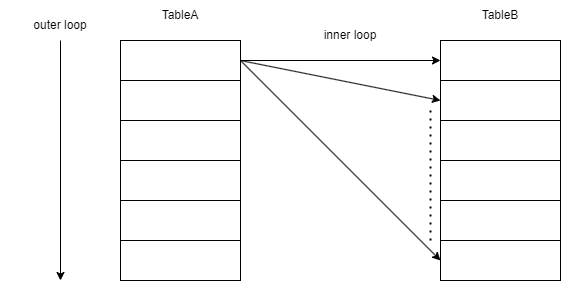

# 1.結合

## 1-1.結合アルゴリズム

### 1-1-1.Nested Loops

Nested Loopsは、入れ子のループを使うアルゴリズム。
SQLでは、一度の結合で2つのテーブルしか結合しないため、実質的には二重ループと同じ意味となる。
動作イメージは、以下のようになる。。



1. 結合対象となるテーブル(TableA)を1行ずつループしながらスキャンする。このテーブルを**駆動表**または**外部表**と呼ぶ。もう一方のテーブル(TableB)は**内部表**と呼ぶ。
2. 駆動表の1行に対し、内部表を1行ずつスキャンして、結合条件に合致すればそれを返却する。
3. この動作を駆動表のすべての行に対して繰り返す。

#### 特徴

Nested Loopsには、以下のような特徴がある。

- TableA、TableBの結合対象の行数をR(A)、R(B)とすると、アクセスされる行数は、R(A) × R(B)となる。Nested Loopsの実行時間はこの行数に比例する。
- 1つのステップで処理する行数が少ないため、Hash JoinやSort Merge Joinに比べてメモリ消費量が少ない。

#### 駆動表の重要性

Nested Loopsにおいて、「駆動表に小さなテーブルを選ぶ(=検索条件にて絞り込んだ結果、より絞り込めたほうテーブルを駆動表として選ぶ)」ことが重要である。
結局のところ、アクセスされる行数はR(A) × R(B)であるので、駆動表が大きかろうと小さかろうと結合コストに差は生まれないと考えられるかもしれないが、
この「駆動表を小さく」には、「内部表の結合キーの列にインデックスが存在すること」という暗黙の条件がある。

もし、内部表の結合キーの列にインデックスが存在する場合、内部表のループをある程度スキップすることが可能である。


理想的なケースでは、駆動表のレコード1行に対して内部表のレコードが1行に対応していれば、
内部表のインデックスをたどることでループすることなく行を特定できるため、内部表のループを
省略できる。このときのアクセス行数は、R(A) × 2となる。


- 内部表のインデックスが使用されるNested Loops

```text
Plan hash value: 3989081241

--------------------------------------------------------------------------------------------
| Id  | Operation                    | Name        | Rows  | Bytes | Cost (%CPU)| Time     |
--------------------------------------------------------------------------------------------
|   0 | SELECT STATEMENT             |             |       |       |     3 (100)|          |
|   1 |  NESTED LOOPS                |             |     1 |    54 |     3   (0)| 00:00:01 |
|   2 |   NESTED LOOPS               |             |     1 |    54 |     3   (0)| 00:00:01 |
|   3 |    TABLE ACCESS FULL         | EMPLOYEES   |     1 |    32 |     3   (0)| 00:00:01 |
|*  4 |    INDEX UNIQUE SCAN         | PK_DEP      |     1 |       |     0   (0)|          |
|   5 |   TABLE ACCESS BY INDEX ROWID| DEPARTMENTS |     1 |    22 |     0   (0)|          |
--------------------------------------------------------------------------------------------

Query Block Name / Object Alias (identified by operation id):
-------------------------------------------------------------

   1 - SEL$58A6D7F6
   3 - SEL$58A6D7F6 / E@SEL$1
   4 - SEL$58A6D7F6 / D@SEL$1
   5 - SEL$58A6D7F6 / D@SEL$1

Predicate Information (identified by operation id):
---------------------------------------------------

   4 - access("E"."DEPT_ID"="D"."DEPT_ID")

Column Projection Information (identified by operation id):
-----------------------------------------------------------

   1 - "E"."EMP_ID"[CHARACTER,8], "E"."EMP_NAME"[VARCHAR2,32],
       "E"."DEPT_ID"[CHARACTER,2], "D"."DEPT_NAME"[VARCHAR2,32]
   2 - "E"."EMP_ID"[CHARACTER,8], "E"."EMP_NAME"[VARCHAR2,32],
       "E"."DEPT_ID"[CHARACTER,2], "D".ROWID[ROWID,10]
   3 - "E"."EMP_ID"[CHARACTER,8], "E"."EMP_NAME"[VARCHAR2,32],
       "E"."DEPT_ID"[CHARACTER,2]
   4 - "D".ROWID[ROWID,10]
   5 - "D"."DEPT_NAME"[VARCHAR2,32]

Hint Report (identified by operation id / Query Block Name / Object Alias):
Total hints for statement: 2
---------------------------------------------------------------------------

   1 -  SEL$58A6D7F6
           -  LEADING(E D)

   4 -  SEL$58A6D7F6 / D@SEL$1
           -  USE_NL(D)
```

- 内部表のインデックスが使用されないNested Loops

```text
Plan hash value: 2277350873

----------------------------------------------------------------------------------
| Id  | Operation          | Name        | Rows  | Bytes | Cost (%CPU)| Time     |
----------------------------------------------------------------------------------
|   0 | SELECT STATEMENT   |             |       |       |    13 (100)|          |
|   1 |  NESTED LOOPS      |             |     6 |   180 |    13   (0)| 00:00:01 |
|   2 |   TABLE ACCESS FULL| EMPLOYEES   |     6 |   120 |     3   (0)| 00:00:01 |
|*  3 |   TABLE ACCESS FULL| DEPARTMENTS |     1 |    10 |     2   (0)| 00:00:01 |
----------------------------------------------------------------------------------

Query Block Name / Object Alias (identified by operation id):
-------------------------------------------------------------

   1 - SEL$58A6D7F6
   2 - SEL$58A6D7F6 / E@SEL$1
   3 - SEL$58A6D7F6 / D@SEL$1

Predicate Information (identified by operation id):
---------------------------------------------------

   3 - filter("E"."DEPT_ID"="D"."DEPT_ID")

Column Projection Information (identified by operation id):
-----------------------------------------------------------

   1 - "E"."EMP_ID"[CHARACTER,8], "E"."EMP_NAME"[VARCHAR2,32],
       "E"."DEPT_ID"[CHARACTER,2], "D"."DEPT_NAME"[VARCHAR2,32]
   2 - "E"."EMP_ID"[CHARACTER,8], "E"."EMP_NAME"[VARCHAR2,32],
       "E"."DEPT_ID"[CHARACTER,2]
   3 - "D"."DEPT_NAME"[VARCHAR2,32]

Hint Report (identified by operation id / Query Block Name / Object Alias):
Total hints for statement: 3
---------------------------------------------------------------------------

   1 -  SEL$58A6D7F6
           -  LEADING(E D)

   3 -  SEL$58A6D7F6 / D@SEL$1
           -  FULL(D)
           -  USE_NL(D)
```

### 1-1-2.Hash Join

ハッシュ結合は、まず小さいほうのテーブルをスキャンし、結合キーに対してハッシュ関数を適用することでハッシュ値に変換する。
その次にもう一方のテーブルをスキャンして、結合キーがそのハッシュ値に存在するかどうか調べる・・・という方法で結合を行う。
小さいほうのテーブルからハッシュテーブルを作成するのは、ハッシュテーブルはメモリ(PGA)に保持されるため、なるべく小さいほうが
効率が良いためである。


- ハッシュ結合の実行計画

```text
Plan hash value: 2052257371

----------------------------------------------------------------------------------
| Id  | Operation          | Name        | Rows  | Bytes | Cost (%CPU)| Time     |
----------------------------------------------------------------------------------
|   0 | SELECT STATEMENT   |             |       |       |     6 (100)|          |
|*  1 |  HASH JOIN         |             |     6 |   180 |     6   (0)| 00:00:01 |
|   2 |   TABLE ACCESS FULL| DEPARTMENTS |     4 |    40 |     3   (0)| 00:00:01 |
|   3 |   TABLE ACCESS FULL| EMPLOYEES   |     6 |   120 |     3   (0)| 00:00:01 |
----------------------------------------------------------------------------------

Query Block Name / Object Alias (identified by operation id):
-------------------------------------------------------------

   1 - SEL$58A6D7F6
   2 - SEL$58A6D7F6 / D@SEL$1
   3 - SEL$58A6D7F6 / E@SEL$1

Predicate Information (identified by operation id):
---------------------------------------------------

   1 - access("E"."DEPT_ID"="D"."DEPT_ID")

Column Projection Information (identified by operation id):
-----------------------------------------------------------

   1 - (#keys=1; rowset=256) "E"."DEPT_ID"[CHARACTER,2],
       "D"."DEPT_NAME"[VARCHAR2,32], "E"."EMP_ID"[CHARACTER,8],
       "E"."EMP_NAME"[VARCHAR2,32]
   2 - (rowset=256) "D"."DEPT_ID"[CHARACTER,2],
       "D"."DEPT_NAME"[VARCHAR2,32]
   3 - (rowset=256) "E"."EMP_ID"[CHARACTER,8],
       "E"."EMP_NAME"[VARCHAR2,32], "E"."DEPT_ID"[CHARACTER,2]

Hint Report (identified by operation id / Query Block Name / Object Alias):
Total hints for statement: 2
---------------------------------------------------------------------------

   1 -  SEL$58A6D7F6
           -  LEADING(D E)

   3 -  SEL$58A6D7F6 / E@SEL$1
           -  USE_HASH(E)
```

#### 1-1-2-1.Hash Joinの特徴

主なHash Joinの特徴は以下の通りである。

- 結合テーブルからハッシュテーブルを作成するために、Nested Loopsに比べるとメモリを多く消費する。
- メモリ内にハッシュテーブルが収まらないとストレージを使用することになり、遅延が発生する(いわゆる、**TEMP落ち**)
- 出力となるHash値は入力値の順序性を保持しないため、等直結合でしか使用できない。

#### 1-1-2-1.Hash Joinが有効なケース

Hash Joinが有効なケースとして、次のような場合が考えられる。

- Nested Loopsで適切な駆動表が存在しない場合
- Nested Loopsおいて、駆動表として小さいテーブルは指摘できるが内部表のヒット件数が多い場合
- Nested Loopsの内部表にインデックスが存在しない場合

Hash Joinは、Nested Loopsが効率的に動作しない場合の次善策となる。
ただし、以下のようなトレードオフがある。

1. Nested Loopsに比べ、メモリ使用量が多い。したがって、OLTP処理のSQLでHash Joinが使用されるとメモリが枯渇してストレージが利用されることによって、処理が遅延するリスクが伴う。
2. Hash Joinでは、必ず両方のテーブルのレコードを全権読み込む必要があるため、TABLE ACCESS FULLが選択されることが多い。

### 1-1-3.Sort Merge

Sort Mergeは、結合対象のテーブルをそれぞれ結合キーでソートを行い、一致する結合キーを見つけたらそれを結果セットに含める。


#### 1-1-3-1.Sort Mergeの特徴

このアルゴリズムは、次のような性質を持つ。

- 対象テーブルをどちらもソートする必要があるため、Nested Loopsよりも多くのメモリを消費する。Hash Joinと比較してどうであるかは、テーブルの規模にも依存するが、Hash Joinは片方のテーブルに対してのみハッシュテーブルを作らないため、Hash Joinよりも多くのメモリを使うこともある。メモリ不足により**TEMP落ち**によるディスクI/Oが発生して遅延するリスクがあるのもHash Joinと同様。
- Hash Joinと違い、等直結合だけでなく不等号を使った結合にも利用できる。ただし、否定条件の結合では利用できない。
- (原理的には)テーブルが結合キーでソート済みになっていれば、ソートをスキップできる。ただし、SQLではテーブルの行の物理配置は意識しないことになっているので、この恩恵を受けられるとしても実装依存となる。
- テーブルをソートするため、片方のテーブルをすべてスキャンしたところで結合を終了できる。