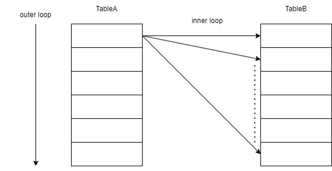
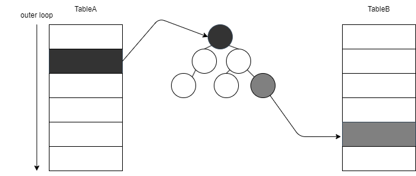

# Oracleパフォーマンスガイド

当ドキュメントでは、Oracleのパフォーマンス面において重要な事柄を説明する。
参照した書籍やWEBサイトについては、最後の記述する。

# 1.結合

## 1-1.結合アルゴリズム

### 1-1-1.Nested Loops

Nested Loopsは、入れ子のループを使うアルゴリズム。
SQLでは、一度の結合で2つのテーブルしか結合しないため、実質的には二重ループと同じ意味となる。
動作イメージは、以下のようになる。。

1. 結合対象となるテーブル(TableA)を1行ずつループしながらスキャンする。このテーブルを**駆動表**または**外部表**と呼ぶ。もう一方のテーブル(TableB)は**内部表**と呼ぶ。
2. 駆動表の1行に対し、内部表を1行ずつスキャンして、結合条件に合致すればそれを返却する。
3. この動作を駆動表のすべての行に対して繰り返す。

#### 特徴

Nested Loopsには、以下のような特徴がある。

- TableA、TableBの結合対象の行数をR(A)、R(B)とすると、アクセスされる行数は、R(A) × R(B)となる。Nested Loopsの実行時間はこの行数に比例する。
- 1つのステップで処理する行数が少ないため、Hash JoinやSort Merge Joinに比べてメモリ消費量が少ない。

#### 駆動表の重要性

Nested Loopsにおいて、「駆動表に小さなテーブルを選ぶ(=検索条件にて絞り込んだ結果、より絞り込めたほうテーブルを駆動表として選ぶ)」ことが重要である。
結局のところ、アクセスされる行数はR(A) × R(B)であるので、駆動表が大きかろうと小さかろうと結合コストに差は生まれないと考えられるかもしれないが、
この「駆動表を小さく」には、「内部表の結合キーの列にインデックスが存在すること」という暗黙の条件がある。

もし、内部表の結合キーの列にインデックスが存在する場合、内部表のループをある程度スキップすることが可能である。

